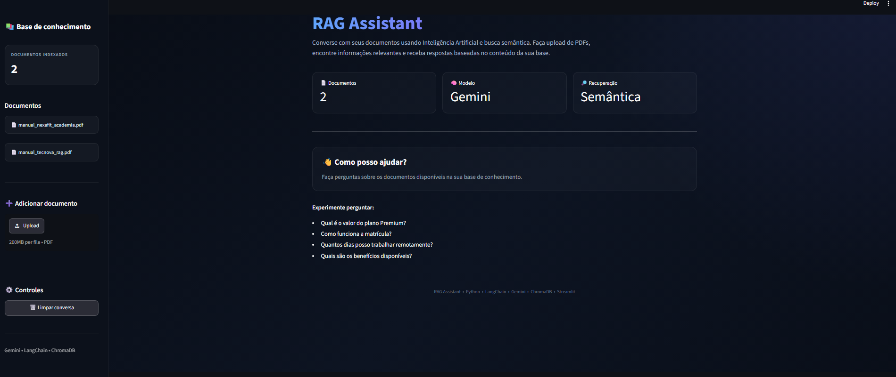

# 📚 RAG Assistant

Assistente inteligente capaz de **responder perguntas com base em documentos PDF**, utilizando Inteligência Artificial e busca semântica.

O sistema encontra as informações mais relevantes na base de documentos, gera uma resposta objetiva e apresenta as fontes utilizadas.

---

## 🖥️ Demonstração



---

## 💡 Sobre o projeto

Empresas armazenam informações importantes em manuais, políticas, procedimentos e outros documentos.

Encontrar uma informação específica nesses arquivos pode ser demorado.

O **RAG Assistant** permite transformar documentos PDF em uma base de conhecimento consultável através de perguntas em linguagem natural.

Por exemplo:

> **"Como funciona a matrícula?"**

A aplicação pesquisa os documentos, encontra os trechos relacionados à pergunta e utiliza Inteligência Artificial para gerar uma resposta baseada no conteúdo encontrado.

---

## ✨ Principais funcionalidades

- 📄 Upload de documentos PDF
- 💬 Perguntas em linguagem natural
- 🔎 Busca semântica nos documentos
- 🤖 Respostas geradas com Inteligência Artificial
- 📚 Exibição das fontes utilizadas
- 💾 Armazenamento vetorial dos documentos
- 🖥️ Interface web interativa
- ⚠️ Tratamento de erros e limites da API

---

## ⚙️ Como funciona

```text
Documento PDF
      ↓
Processamento e divisão do conteúdo
      ↓
Geração de embeddings
      ↓
Armazenamento no ChromaDB
      ↓
Busca semântica
      ↓
Contexto enviado ao Gemini
      ↓
Resposta + fontes
```

A aplicação utiliza a arquitetura **RAG (Retrieval-Augmented Generation)**.

Em vez de depender apenas do conhecimento do modelo de IA, o sistema primeiro recupera informações relevantes dos documentos e utiliza esse conteúdo como contexto para gerar a resposta.

---

## 🛠️ Tecnologias utilizadas

**Python** • **LangChain** • **Google Gemini** • **ChromaDB** • **Streamlit**

Conceitos aplicados:

`RAG` `LLMs` `Embeddings` `Vector Database` `Semantic Search` `Prompt Engineering`

---

## 📂 Estrutura do projeto

```text
rag-assistant/
│
├── assets/          # Imagens do projeto
├── config/          # Configurações e prompts
├── documents/       # Documentos utilizados pela aplicação
├── src/             # Código principal do sistema
├── tests/           # Testes dos componentes
│
├── app.py           # Interface via terminal
├── web_app.py       # Interface web
├── ingest.py        # Processamento dos documentos
├── requirements.txt
├── .env.example
└── README.md
```

---

## 🚀 Como executar

### 1. Clone o projeto

```bash
git clone https://github.com/pcmdevs/rag-assistant.git
cd rag-assistant
```

### 2. Instale as dependências

```bash
pip install -r requirements.txt
```

### 3. Configure a API

Crie um arquivo `.env` na raiz do projeto utilizando o `.env.example` como referência.

```env
GEMINI_API_KEY=your_gemini_api_key_here
```

> A chave real da API não deve ser adicionada ao GitHub.

### 4. Processe os documentos

```bash
python ingest.py
```

### 5. Execute a aplicação

```bash
streamlit run web_app.py
```

---

## 🧪 Documentos de demonstração

O projeto acompanha documentos fictícios utilizados para demonstrar o funcionamento do sistema.

Eles permitem testar perguntas relacionadas a diferentes contextos sem utilizar informações reais ou confidenciais.

---

## 🔮 Próximas melhorias

- Memória de conversa
- Streaming das respostas
- Suporte a outros formatos de arquivo
- Aprimoramento do sistema de recuperação
- Testes automatizados adicionais
- Containerização com Docker
- Deploy público

---

## 👨‍💻 Autor

Desenvolvido por **Paulo Cesar** como projeto de portfólio voltado à aplicação prática de Inteligência Artificial, RAG e processamento de documentos.